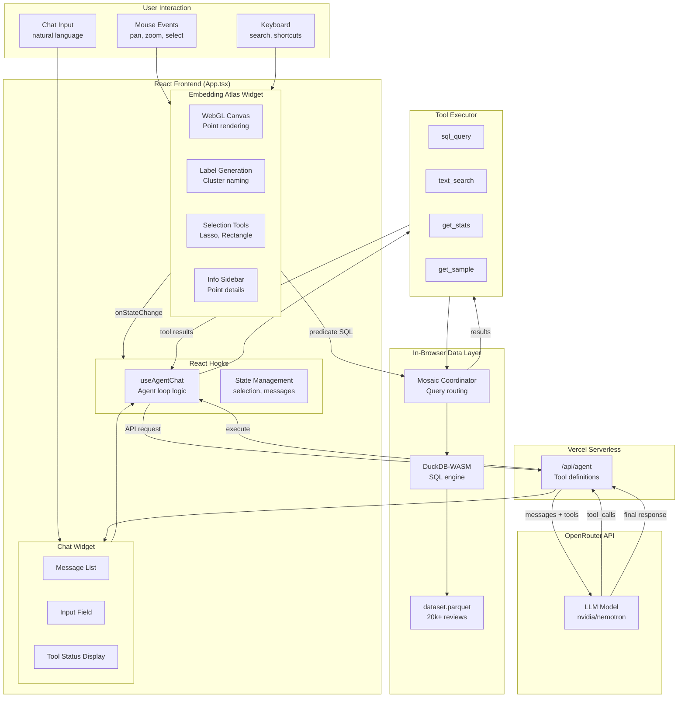
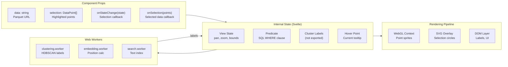
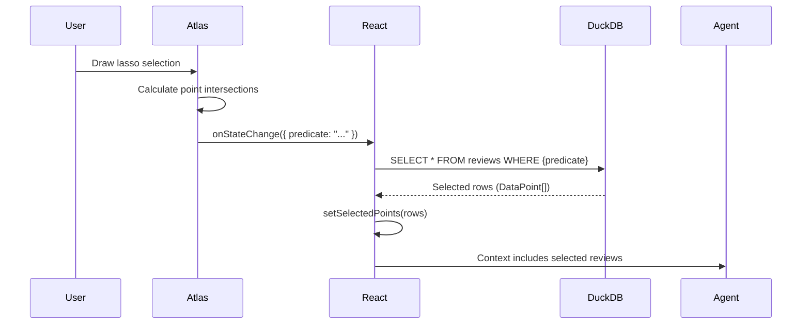
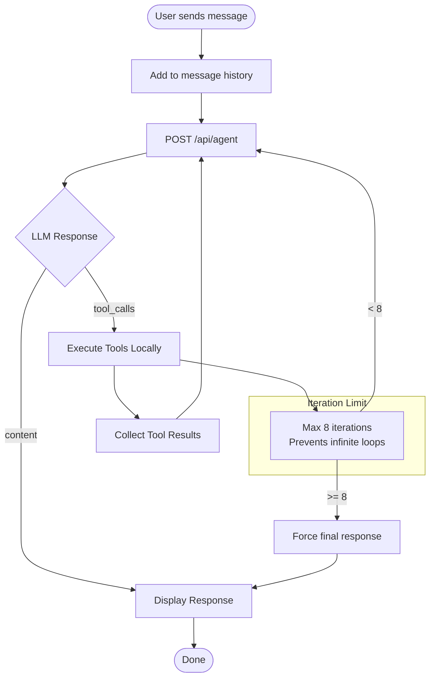
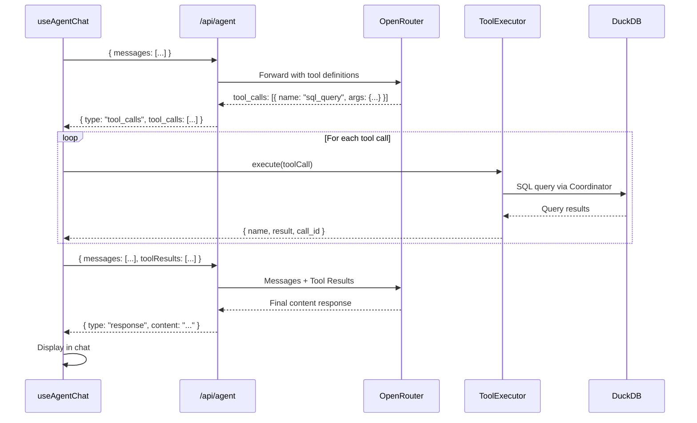
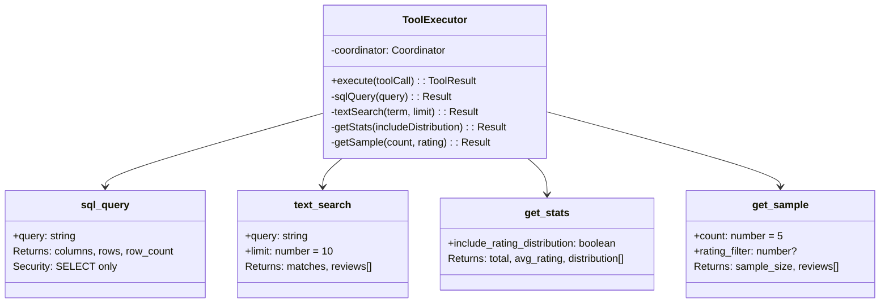
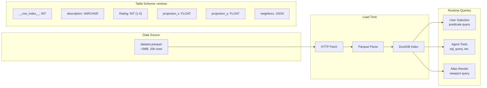
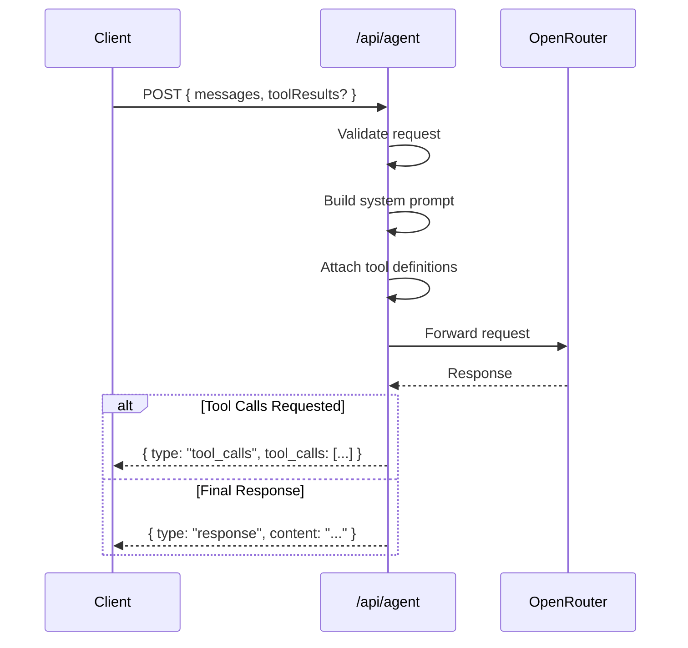
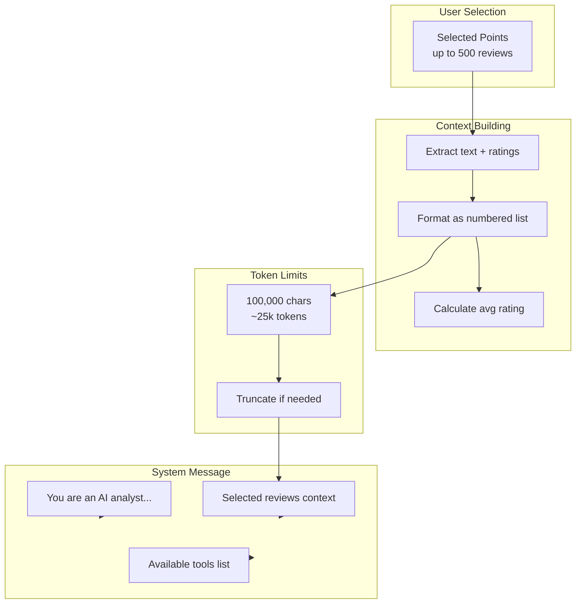
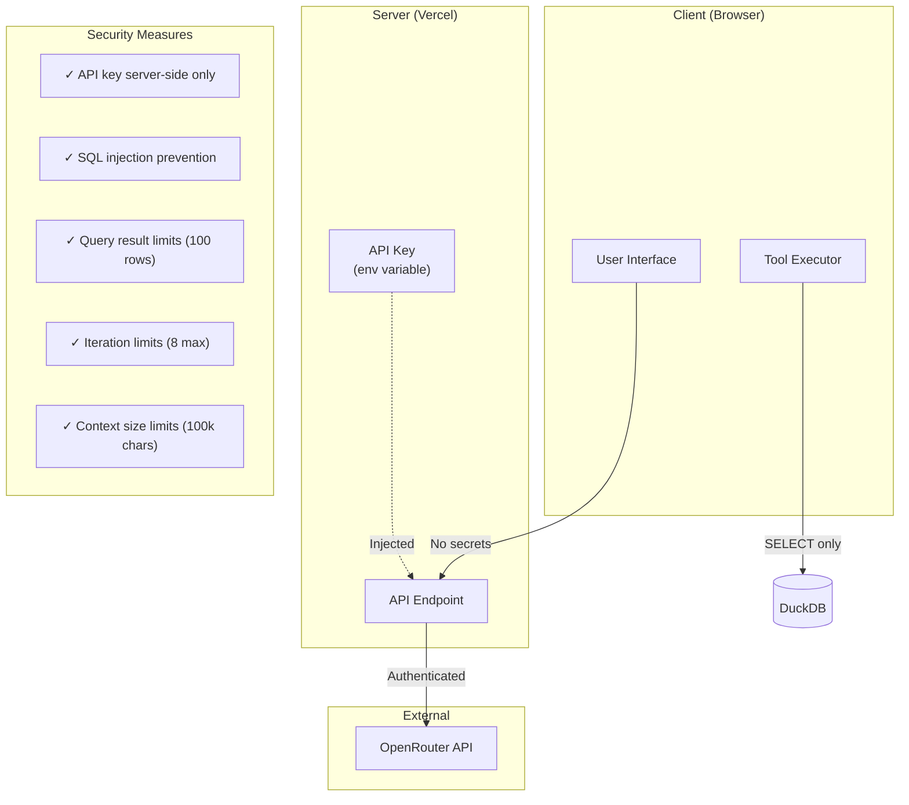

# Atlas Agent Architecture

This document provides a detailed technical overview of how the Atlas visualization widget works and how the AI agent integrates with it.

---

## System Overview



---

## Atlas Widget Internals

The `EmbeddingAtlas` component from Apple handles visualization and interaction.



### Atlas State Object

When `onStateChange` fires, it provides:

```typescript
interface AtlasState {
  predicate: string | null;  // SQL WHERE clause for selection
  // e.g., "__row_index__ IN (1, 2, 3, ...)"
}
```

### Selection Flow



---

## Agent Architecture

### Agent Loop



### Tool Execution Detail



---

## Tool Definitions



---

## Data Flow



---

## API Endpoints

### POST /api/agent



---

## Context Management



---

## File Structure

```
web-app/
├── api/
│   ├── chat.ts              # Simple chat endpoint (Phase 1)
│   └── agent.ts             # Agent with tools (Phase 2)
│
├── src/
│   ├── App.tsx              # Main component
│   ├── App.css              # Styles
│   │
│   ├── hooks/
│   │   └── useAgentChat.ts  # Agent loop logic
│   │
│   └── tools/
│       └── toolExecutor.ts  # DuckDB tool execution
│
├── docs/
│   ├── ARCHITECTURE.md      # This file
│   └── ROADMAP.md           # Feature roadmap
│
├── public/
│   └── data/
│       ├── dataset.parquet  # Review embeddings
│       └── metadata.json    # Schema info
│
└── vercel.json              # Deployment config
```

---

## Security Model



---

## Performance Considerations

| Component | Strategy |
|-----------|----------|
| Parquet Loading | Single fetch, browser cached |
| DuckDB Queries | In-memory, ~10-50ms per query |
| Atlas Rendering | WebGL, handles 100k+ points |
| LLM Latency | 1-3s per request (model dependent) |
| Tool Execution | Local, <100ms per tool |
