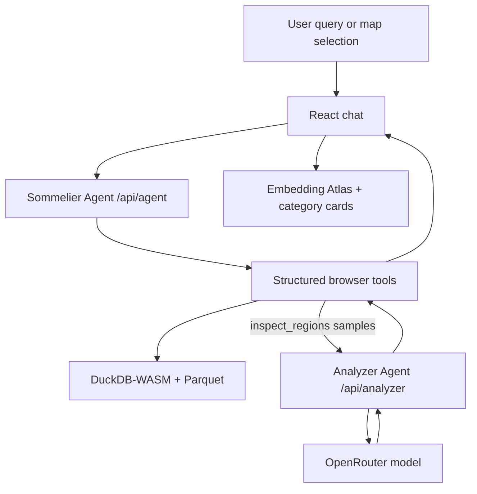
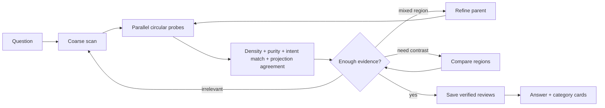

# Atlas Agent Architecture

## System overview

```mermaid
flowchart TB
    User["User query or map selection"] --> Chat["React chat"]
    Chat --> Orchestrator["Sommelier Agent /api/agent"]
    Orchestrator --> Tools["Structured browser tools"]
    Tools --> DuckDB["DuckDB-WASM + Parquet"]
    Tools -->|"inspect_regions samples"| Analyzer["Analyzer Agent /api/analyzer"]
    Analyzer --> LLM["OpenRouter model"]
    LLM --> Analyzer
    Analyzer --> Tools
    Tools --> Chat
    Chat --> Atlas["Embedding Atlas + category cards"]
```

The system has two agents. The Sommelier is the strategic decision-maker; the Analyzer interprets review samples from circular regions. Data retrieval and geometry run locally in the browser.

## Tool protocol

The live protocol has six orthogonal tools:

1. `search_reviews` for known lexical and metadata constraints.
2. `scan_regions` for coarse grid-based candidate generation.
3. `inspect_regions` for up to eight parallel circular probes, each returning Analyzer summaries, semantic purity, and user-intent match.
4. `refine_region` for smaller candidate circles inside a promising parent.
5. `compare_regions` for consistent quantitative contrasts.
6. `save_results` for client-side UI memory.

The Agent no longer receives unrestricted SQL. SQL remains inside `ToolExecutor`, which constructs queries from bounded structured parameters.

`SearchPolicy` sits between LLM tool calls and `ToolExecutor`. It rewrites partially valid probe batches, blocks duplicate or over-budget actions, scores candidate utility, enforces semantic state transitions, records discoveries, and exposes a deterministic policy snapshot to both the LLM and UI.

## Agentic traversal

```mermaid
flowchart LR
    Query["Question"] --> Scan["Coarse scan"]
    Scan --> Probe["Parallel circular probes"]
    Probe --> Observe["Density + purity + intent match + projection agreement"]
    Observe --> Decision{"Enough evidence?"}
    Decision -->|"mixed region"| Refine["Refine parent"]
    Refine --> Probe
    Decision -->|"need contrast"| Compare["Compare regions"]
    Compare --> Decision
    Decision -->|"irrelevant"| Scan
    Decision -->|"yes"| Save["Save verified reviews"]
    Save --> Answer["Answer + category cards"]
```

The loop is agentic because each next action depends on prior observations. `inspect_regions` performs the “throw several circles, observe, and try again” pattern in one bounded tool call.

## Projection semantics

Grid cells are used only for cheap coarse scanning. Inspection uses true circles based on squared Euclidean distance in projection coordinates. Because UMAP does not preserve all neighborhoods or global density, each inspected sample also checks its stored high-dimensional neighbor IDs and reports `projection_agreement`: the fraction whose coordinates lie in the current circle.

This signal is diagnostic rather than proof. The Analyzer's content evidence and explicit metadata constraints remain necessary.

Each probe passes a concise user intent to the Analyzer. `purity` measures internal semantic coherence, whereas `intent_match` measures external relevance to that intent. They are deliberately independent: a circle may be highly pure but irrelevant, or relevant but semantically mixed.

## Policy state

Each request owns an isolated controller session. It records accepted, filtered, blocked, completed, and failed actions; unique inspected circles; candidate utility/state; relevant-theme coverage; consecutive semantic no-progress rounds; remaining budgets; and an explicit stop reason. The controller—not the prompt—has final authority over whether a tool call executes.

## Client memory

`useAgentChat` caches inspected-region results. A later `save_results` call resolves verified IDs against this cache and stores full review metadata in `savedCategories`. Exact `{{CATEGORY}}` placeholders in the final response hydrate into interactive cards.

See [Projection-Guided Agentic Search](PROJECTION_AGENT_SEARCH.md) for research framing and evaluation hooks.
